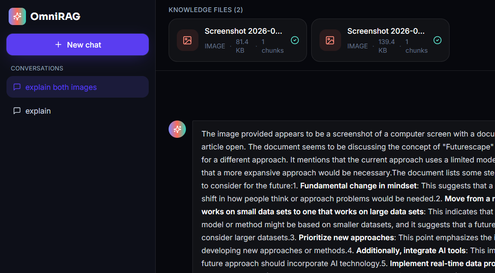

<div align="center">

# OmniRAG

### Universal Multimodal AI Knowledge Assistant

**Chat with any file — grounded, cited, hallucination-checked answers.**

Runs 100% locally · $0 infrastructure cost · no cloud APIs required


</div>

---

## Overview

**OmniRAG** turns everyday files — PDFs, slide decks, Word documents, source code, spreadsheets, and images — into a conversational knowledge base. Upload documents, ask questions in plain language, and receive **streaming answers with clickable citations** pointing to the exact page, slide, line, or row the answer came from.

The engineering focus of this project is the layer most RAG demos skip: **per-file-type ingestion that preserves provenance**. Every document type gets its own loader and chunking strategy, normalizing heterogeneous files into a common shape that carries source metadata. At query time, that metadata powers document-scoped retrieval, citations computed independently of generation, and a **hallucination guard** that forces the model to answer only from retrieved context — or state that the answer wasn't found.

Everything runs on your machine: local embeddings (sentence-transformers), an on-disk vector database (ChromaDB), and a local LLM served by Ollama — with an optional free-tier Groq fallback.

## Screenshots

<p align="center">
  
  <br>
  <em>Landing page — drag-and-drop ingestion for PDF, DOCX, PPTX, TXT, code, CSV/Excel, and images</em>
</p>

<p align="center">
  
  <br>
  <em>Chat interface — knowledge-file cards, conversation history, and streaming grounded answers</em>
</p>

## Key features

### 🧠 Retrieval & grounding

- **Per-type ingestion pipelines** — PyMuPDF (PDF), python-docx, python-pptx, pandas/openpyxl, a 13-language code detector, and Tesseract OCR for images — each chunk tagged with page / slide / line / row provenance.
- **Content-aware chunking** — per-file-type chunk sizes with boundary-aware splitting for source code.
- **Local embeddings & vector search** — `all-MiniLM-L6-v2` (384-d) into ChromaDB, organized as per-workspace collections with metadata filters (`file_id`, `page`, `slide`, `lang`, `branch`).
- **Hallucination guard** — a grounded-only system prompt requires answers to come from retrieved context and an explicit "not found in the uploaded files" response otherwise.
- **Citations computed independently of generation** — every answer links file, location, snippet, and relevance score.

### 💬 Chat experience

- **Streaming responses** over Server-Sent Events, with markdown and syntax-highlighted code rendering.
- **Document-scoped chat** — "Ask about" chips filter retrieval to selected files, so answers respect exactly the documents you choose.
- **Six response modes** — Default, Simple, Deep, Exam, Code, Research.
- **Conversation management** — create, rename, delete, persisted history with automatic titles.
- **Shareable links** — a URL (`?w=…&c=…`) restores the full workspace and conversation for anyone with the link.
- **Polished React UI** — dark theme, drag-and-drop upload, file cards, and citation cards.

### 🖼️ Multimodal

- **Image files are first-class knowledge** — OCR extracts embedded text, and raw pixels are passed to a local vision model (`llava`) at query time, so diagrams and screenshots are answerable like any document.

### ⚙️ Engineering & operations

- **100% local and free by default** — no paid APIs; optional Groq free-tier fallback.
- **One-command Docker Compose** stack for backend + frontend.
- **Evaluation harness** — pytest suites plus a RAGAS-based eval pipeline measuring retrieval and answer quality.

---

## Tech stack

| Layer | Technology |
|---|---|
| **Frontend** | React 18 · Vite 5 · Tailwind CSS 3 · react-markdown · react-syntax-highlighter · lucide-react |
| **Backend / API** | FastAPI 0.115 · Uvicorn · SSE streaming (sse-starlette) · Pydantic v2 |
| **Retrieval** | sentence-transformers (`all-MiniLM-L6-v2`) · ChromaDB (on-disk, per-workspace) |
| **Generation** | Ollama local LLMs (`llama3.1:8b`; vision: `llava:7b`) · optional Groq free tier |
| **File processing** | PyMuPDF · python-docx · python-pptx · pandas · openpyxl · Pillow · Tesseract OCR |
| **Quality** | pytest · RAGAS evaluation harness |
| **Tooling** | Docker & docker-compose · Git |

## Architecture

```
┌──────────────────────────┐        ┌───────────────────────────────────────┐
│  React + Vite + Tailwind │  HTTP  │           FastAPI backend             │
│  (chat UI, upload UI)    │◄──────►│                                       │
└──────────────────────────┘  SSE   │  ingestion/  (per-file-type loaders)  │
                                    │  chunking.py (content-aware splitting)│
                                    │  embeddings.py (sentence-transformers)│
                                    │  vectorstore.py (Chroma, per-workspace│
                                    │  rag.py (retrieval + grounded prompt) │
                                    │  llm.py (Ollama / Groq streaming)     │
                                    │  memory.py (workspaces/files/chats)   │
                                    └───────────────────────────────────────┘
```

**Request flow for a chat message:**

1. The frontend `POST`s the question to `/chat/stream`.
2. The question is embedded and matched against Chroma for the top-k chunks — optionally filtered to the files you selected.
3. Retrieved chunks form a context block, each tagged with its source location (page / slide / line / row).
4. A grounded system prompt instructs the LLM to answer **only** from that context — or state the answer wasn't found.
5. Tokens stream to the UI over SSE, and citations are rendered alongside the answer from the same retrieval results.

## Getting started

### Prerequisites

- **Python 3.11**
- **Node.js 18+**
- **[Ollama](https://ollama.com)** with `llama3.1:8b` (add `llava:7b` for image Q&A)
- *Optional:* [Tesseract OCR](https://github.com/UB-Mannheim/tesseract/wiki) for scanned documents and images
- *Optional:* Docker, if you prefer containers

### 1. Backend

```bash
cd backend
python -m venv venv
source venv/bin/activate        # Windows: venv\Scripts\activate
pip install -r requirements.txt
cp .env.example .env            # defaults work for local Ollama
uvicorn app.main:app --reload --port 8000
```

### 2. Frontend

```bash
cd frontend
npm install
npm run dev                     # → http://localhost:5173
```

### 3. Local LLM

```bash
ollama serve
ollama pull llama3.1:8b
ollama pull llava:7b            # optional — image understanding
```

Configuration lives in `backend/.env` — every key (LLM provider, model names, embedding model, Chroma path, upload limits, CORS origins) is documented in `.env.example`.

### Docker (alternative)

```bash
docker compose up --build       # backend :8000, frontend :5173
```

## Testing & evaluation

```bash
cd backend
pytest                          # unit & integration suites
python -m tests.eval_rag        # RAG quality harness (golden set)
```

The evaluation harness runs a 15-question golden set (factual, cross-file, code, and deliberately unanswerable) and reports **Recall@k**, **MRR**, keyword answer accuracy, a lightweight LLM judge, and **RAGAS** metrics — faithfulness, answer relevance, context precision, and context recall — writing full per-question results to `backend/eval/results.json`.

## Project structure

```
omnirag/
├── backend/
│   ├── app/
│   │   ├── main.py             # FastAPI app & routes
│   │   ├── ingestion/          # per-file-type loaders (pdf, docx, pptx, code, csv, images)
│   │   ├── chunking.py         # content-aware splitting
│   │   ├── embeddings.py       # sentence-transformers
│   │   ├── vectorstore.py      # Chroma, per-workspace collections
│   │   ├── rag.py              # retrieval + grounded prompting
│   │   ├── llm.py              # Ollama / Groq streaming
│   │   └── memory.py           # workspaces, files, conversations
│   ├── tests/                  # pytest suites + eval harness
│   └── requirements.txt
├── frontend/
│   └── src/                    # React app (chat, upload, citations, sidebar)
├── docs/screenshots/           # README imagery
├── docker-compose.yml
└── README.md
```

## Roadmap

Designed with clean extension seams for: cross-encoder **reranking**, hybrid **BM25 + vector** search, **LangGraph** multi-agent workflows, **tree-sitter** AST-level code parsing, authentication & multi-user workspaces, and cloud deployment.

---

<div align="center">

**Richi Upadhyay**

[email](mailto:richiupadhyay2002@gmail.com) · [GitHub @richiupadhyay2002-maker](https://github.com/richiupadhyay2002-maker)

If you find this project valuable, a ⭐ star would be greatly appreciated.

</div>
